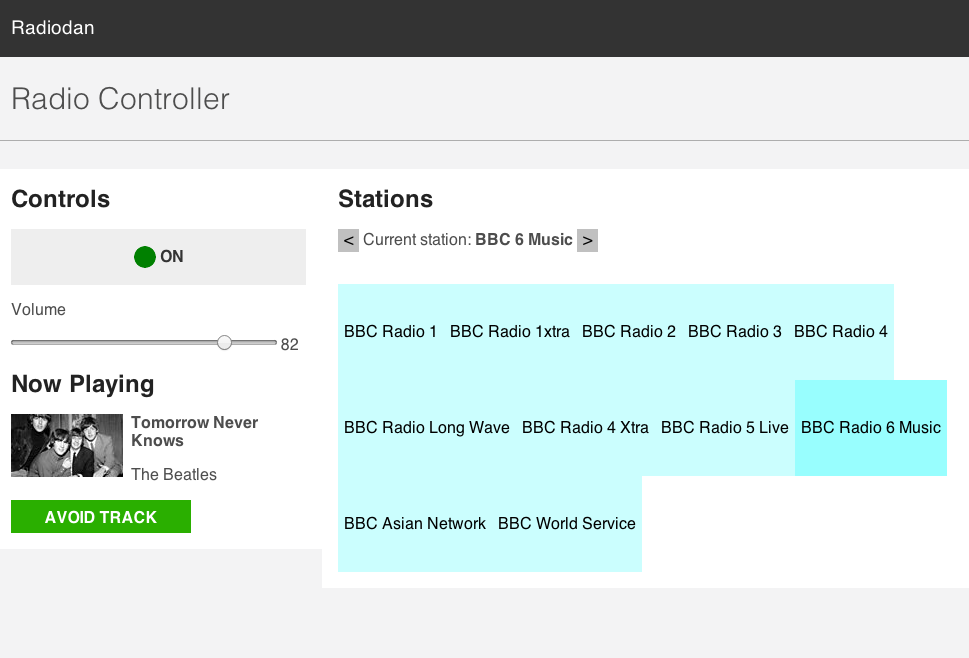

radiodan_example
================

Example application using the radiodan gem

Warning
---

This application is alpha software. We're releasing it to start a discusion about what a radio prototyping platform could be. 

Open an issue if you'd like help getting started.

## Getting started

To run:

    $ foreman start 

More detailed instructions coming soon.

## Features

- Listen to BBC radio stations
- Web app to control the radio
- "Avoid track" button to avoid tracks you don't like
- Physical interface

## Physical interface

The physical interface exists in it's [own repository](https://github.com/radiodan/radiodan_example_physical_interface).

## Structure

The app consists of Radiodan middlewares.

### Radio controller

`lib/middleware/radio_controller.rb`

This listens for events triggered on the player and causes changes on the Radiodan::Playlist object. There's only a single Playlist object that's used.

### Preferences

`lib/middleware/preferences.rb`

Remembers state such as volume and current station in a file and reads it on start-up.

### Faye web server

`lib/middleware/faye_web_server.rb`

This loads a web server, the [Faye messaging server]() and the Web App (see below)

#### Web App

A web app is mounted on port 3000, so will be available on an URL such as `http://raspberrypi.local:3000`.

`lib/web_app.rb` contains the HTTP interface for controlling the radio and displaying basic state information such as the volume and current station. The web app simple triggers events on the player rather than changing anything directly. e.g. to change the volume the `:change_volume` event would be fired with the desired volume value.

Javascript is used to listen and display now playing messages and to change radio stations and volume without relaoding the web page. This uses the Faye. The web app interface is in `lib/views/` and the Javascript and CSS is in `lib/public/`.

### Faye Relay

Converts messages received over the Faye interface into player events understood by the Radio Controller middleware.

### Now Playing

`NowPlayingClient` class in `lib/now_playing_client.rb` subscribes to now playing updates using the [MQTT prototocl](http://mqtt.org/). Messages received are broadcast using [Faye](http://faye.jcoglan.com/) to the web app and other parts of the app.

### Track Avoider

Using the NowPlayingClient to avoid tracks. When the `:avoid, :track` event is triggered and Now Playing information is available for the track, this middleware works out how long of the track is left to play 

## License

The `sounds/birdsong.mp3` is from http://www.freesfx.co.uk

See COPYING file.
